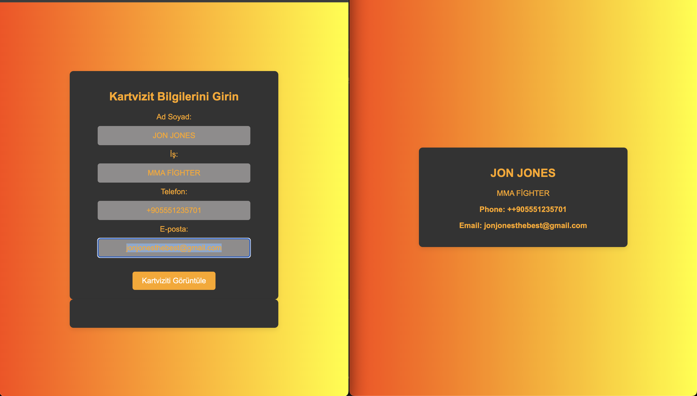

# Business Card Design

This project is a simple business card design application. Users can input their information, and the application will display a business card with the provided details.

## Technologies Used

- HTML
- CSS
- JavaScript

## How to Use

1. Clone the repository to your local machine.
2. Open the `index.html` file in your web browser.
3. Fill in the form with your name, job title, phone number, and email address.
4. Click the "View Business Card" button.
5. Your business card will be displayed with the provided information.

## Files

- `index.html`: The main HTML file that contains the structure of the application.
- `styles.css`: The CSS file that contains the styles for the application.
- `script.js`: The JavaScript file that contains the logic for displaying the business card.

## Example

## License

This project is licensed under the MIT License.

## Note

Please note that all buttons and labels on the site are written in Turkish.